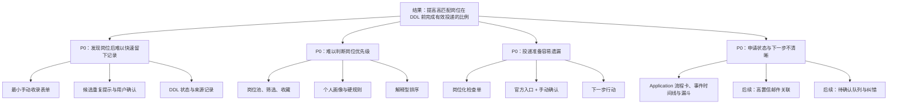

# CampusAI 机会—方案树

> 状态：产品发现基线。假设、评分与实验结论应随证据更新。

## 期望结果

提高**高匹配岗位在投递 DDL 前完成有效投递的比例**。第一轮不预设最终数值，先用真实个人求职数据建立基线。

## 机会地图

| 优先级 | 用户机会 | 用户旅程 | 当前解决阶段 | 需验证证据 |
|---|---|---|---|---|
| P0 | 我看到岗位后，难以在不打断当前浏览的情况下留下可行动记录。 | 投递前 | 闭环 1 | 是否能在 30 秒内完成收录 |
| P0 | 我面对多个岗位时，难以判断哪些值得优先投入。 | 投递前 | 闭环 2 | 用户画像和规则排序是否改善决策 |
| P0 | 我准备投递时，容易遗漏资格、材料或 DDL。 | 投递中 | 闭环 3 | 检查单是否提高有效投递完成率 |
| P0 | 我投递后，不清楚每份申请的状态和下一步。 | 投递后 | 闭环 4（实施中） | Application 视图是否缩短状态查询时间 |
| P1 | 来自共享表、原帖与截图的岗位难以统一收录。 | 投递前 | Phase 2 | 导入与提取是否比手动输入更省时 |
| P1 | 我无法判断 AI 推荐和邮件关联是否可信。 | 全程 | Phase 2 / 闭环 4 | 解释和纠错是否提高采纳率 |
| P2 | 临期或冲突时，我未必及时得到可执行提醒。 | 投递中/后 | 闭环 4 | 提醒是否促成实际行动 |

## 方案树

## 当前 P0 实验：闭环 1

| 假设 | 实验 | 成功阈值 | 当前状态 |
|---|---|---|---|
| 用户需要立即收录而非继续收藏链接 | 使用真实或脱敏岗位连续录入 5 条 | 每条均可在 30 秒内完成；应用重启后仍存在 | 待验证 |
| 候选重复不应阻断真实不同业务线岗位 | 同公司、同岗位、同城市但不同部门的样例 | 用户能查看、更新或确认继续收录 | 待验证 |
| DDL 状态能帮助回看优先级 | 包含临近与已逾期样例 | 状态明确且仍允许保存 | 待验证 |

## 已知边界

本树不把自动投递、受限平台抓取、云端邮箱凭据或黑箱匹配视作候选方案。它们与当前产品边界冲突，除非用户重新授权。

## 闭环 4 当前实验

| 假设 | 最小验证 | 成功阈值 | 当前状态 |
|---|---|---|---|
| 用户需要按申请而非岗位回看进度 | 对多条已投递申请记录阶段、事件和下一步行动 | 可在一页识别当前阶段与计划时间，不遗漏待处理申请 | 实施中 |
| 漏斗应反映曾经到达的阶段 | 对跳阶段和已结束申请验证事件口径 | 已进入后续阶段的申请仍计入已投递及中间层 | 实施中 |
