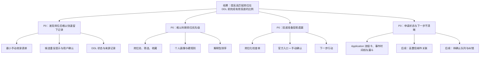

# CampusAI 机会—方案树

> 状态：产品发现基线。假设、评分与实验结论应随证据更新。

## 期望结果

提高**高匹配岗位在投递 DDL 前完成有效投递的比例**。第一轮不预设最终数值，先用真实个人求职数据建立基线。

## 机会地图

| 优先级 | 用户机会 | 用户旅程 | 当前解决阶段 | 需验证证据 |
|---|---|---|---|---|
| P0 | 我看到岗位后，难以在不打断当前浏览的情况下留下可行动记录。 | 投递前 | 闭环 1 | 是否能在 30 秒内完成收录 |
| P0 | 我面对多个岗位时，难以判断哪些值得优先投入。 | 投递前 | 闭环 2 | 用户画像和规则排序是否改善决策 |
| P0 | 我准备投递时，容易遗漏资格、材料或 DDL。 | 投递中 | 闭环 3 | 检查单是否提高有效投递完成率 |
| P0 | 我投递后，不清楚每份申请的状态和下一步。 | 投递后 | 闭环 4（实施中） | Application 视图是否缩短状态查询时间 |
| P1 | 来自共享表、原帖与截图的岗位难以统一收录。 | 投递前 | Phase 2 第一批已实现本地表格导入 | 导入是否比手动输入更省时；原帖/截图提取待验证 |
| P1 | 我无法判断 AI 推荐和邮件关联是否可信。 | 全程 | Phase 2 / 闭环 4 | 第二批已加入用户主动触发、理由/风险和独立 AI 分；邮件关联仍待后续验证。 |
| P2 | 临期或冲突时，我未必及时得到可执行提醒。 | 投递中/后 | 闭环 4 | 提醒是否促成实际行动 |

## 方案树

## 当前 P0 实验：闭环 1

| 假设 | 实验 | 成功阈值 | 当前状态 |
|---|---|---|---|
| 用户需要立即收录而非继续收藏链接 | 使用真实或脱敏岗位连续录入 5 条 | 每条均可在 30 秒内完成；应用重启后仍存在 | 待验证 |
| 候选重复不应阻断真实不同业务线岗位 | 同公司、同岗位、同城市但不同部门的样例 | 用户能查看、更新或确认继续收录 | 待验证 |
| DDL 状态能帮助回看优先级 | 包含临近与已逾期样例 | 状态明确且仍允许保存 | 待验证 |

## 已知边界

本树不把自动投递、受限平台抓取、云端邮箱凭据或黑箱匹配视作候选方案。它们与当前产品边界冲突，除非用户重新授权。

## 闭环 4 当前实验

| 假设 | 最小验证 | 成功阈值 | 当前状态 |
|---|---|---|---|
| 用户需要按申请而非岗位回看进度 | 对多条已投递申请记录阶段、事件和下一步行动 | 可在一页识别当前阶段与计划时间，不遗漏待处理申请 | 实施中 |
| 漏斗应反映曾经到达的阶段 | 对跳阶段和已结束申请验证事件口径 | 已进入后续阶段的申请仍计入已投递及中间层 | 实施中 |

## 邮件关联最小验证

| 假设 | 最小实验 | 成功阈值 | 当前状态 |
|---|---|---|---|
| 用户能在不暴露完整正文的前提下发现投递后关键邮件 | 主动单次同步后检查“邮件待确认”队列，并对低置信分类手动关联/补记 | 明确测评邮件进入队列，且不自动改变申请状态 | 已实现，待真实使用验证 |

## 关键时间验证补充（2026-08-09）

邮件候选时间、事件安排与岗位投递 DDL 必须在界面上可区分。最小验证为：用户可分别确认测评完成截止或面试安排，且表格的“下一关键节点”只显示已确认的投递后行动，不误用岗位 DDL。
## 2026-08-09｜Phase 2 第四批第二阶段（已实现，待验收）

**机会：** 用户难以快速定位需要处理的岗位，长标题会遮挡主操作，邮箱同步失败后无法判断下一步。

**已实施方案：** 可见且可清除的雷达快捷筛选；两行标题截断且保持详情按钮；单次本地同步的安全诊断与配置说明页。

**已验证信号：** 自动化覆盖筛选组合、无画像高匹配降级、同步计数与锁释放、失败诊断脱敏。

**待人工验收：** 使用真实窄屏检查详情按钮可用性；使用真实本地 IMAP 完成一次同步成功与一次可理解的失败恢复。

## 2026-08-09｜Phase 2 第四批第一阶段验证状态

**机会：** 用户需要相信申请历史不会被误判邮件、删除操作或本地数据丢失静默破坏。

**已实施方案：**

- 以唯一精确匹配、状态机和 `EmailEvent` 幂等链接约束邮件自动推进；未满足条件转待确认。
- 对存在任一 `Application` 的岗位拒绝删除，而非级联删除。
- 提供脱敏全量 JSON 导出，以及隔离验证后全量替换的恢复流程；替换前备份并在失败时回滚。
- 使用 Alembic 升级和 schema 验证替代应用启动期间的隐式 schema 补齐。

**已验证信号：** 聚焦自动化测试覆盖已结束申请保护、同一邮件重复请求、删除保护、导出/恢复及坏文件不修改当前库、旧库升级。

**待验证：** 真实本地库恢复后的人工重启体验；第二阶段再验证雷达筛选可发现性、长标题主操作布局和同步诊断信息。AI 匹配与邮件解析升级须另立决策卡，不因本阶段安全修整而提前实现。
## 2026-08-09｜数据安全验收收紧

**风险修正：** 仅靠前端删除按钮、整表 JSON 导出或 Web 内“已恢复”提示都不足以保护个人申请历史。

**已实施：** 服务端删除确认与关联数反馈；字段白名单+邮箱脱敏+版本化导出；应用级恢复锁；替换后等待下一次启动健康检查；Alembic 非 head 升级前自动备份及不可逆迁移测试。

**仍待人工验证：** 使用真实本地服务重启一次，确认等待标记在启动健康检查通过后变为已验证；若检查失败，按页面给出的替换前备份完成回滚。第二阶段和 AI/邮件解析升级仍未开始。
## 2026-08-09｜第一阶段前台可发现性完成

**机会闭环补齐：** 数据安全能力只有在用户能从正常任务页面找到并理解它时才产生价值。

**已实施：** 全局“数据管理”导航入口；岗位详情删除按钮、关联数预览、原生确认弹窗与服务端确认页回退。

**最终验证：** 用户在真实本机服务执行导出、恢复、重启，并确认恢复验证记录出现；该结果决定第一阶段是否正式标记为已验收。
